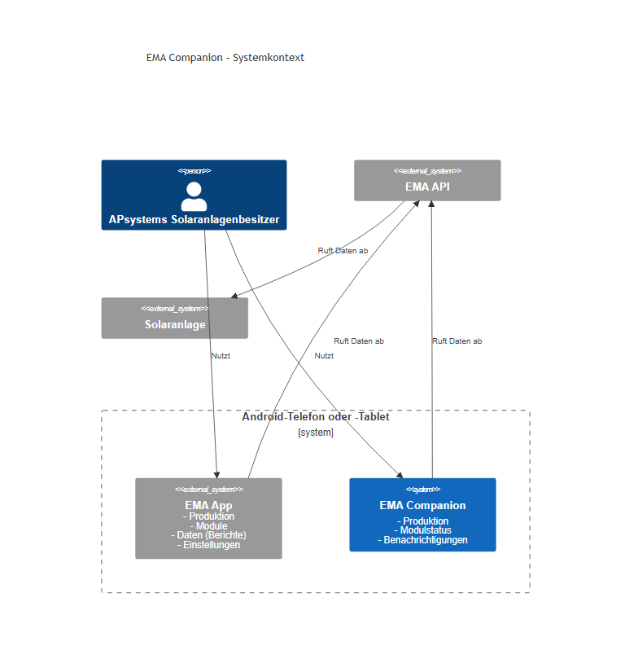

<!-- GENERATED from user-guide.md by the write-user-guide skill. Source of truth is the English file. Do not hand-edit; edit the English and re-run the skill. -->
# EMA Companion Benutzerhandbuch

## Überblick

EMA Companion ist eine Android-App für Besitzer von APsystems-Solaranlagen. Sie ist als Ergänzung zur bestehenden EMA-App gedacht — nicht als Ersatz — und wird Funktionen wie detaillierte Produktionsstatistiken und Diagramme, Startbildschirm-Widgets und Benachrichtigungen bei Störungen ergänzen.

## Erste Schritte

Installieren Sie EMA Companion auf Ihrem Android-Telefon oder -Tablet (Android 12 oder neuer erforderlich). Öffnen Sie die App über Ihren Startbildschirm oder die App-Übersicht durch Tippen auf das **EMA Companion**-Symbol.

**Erster Start:** Die App öffnet sich direkt mit dem Bildschirm **Einstellungen**, und der Navigationspunkt „Startseite" ist deaktiviert. Sie müssen Ihre EMA-API-Zugangsdaten und die Systemleistung eingeben, bevor der Rest der App zugänglich wird.

Sobald die erforderlichen Felder gespeichert sind, wird die untere Navigationsleiste freigeschaltet und Sie können frei zwischen den Bildschirmen wechseln.

## Navigation

Am unteren Rand jedes Bildschirms verläuft eine Navigationsleiste mit drei Zielen:

- **Startseite** — das Haupt-Dashboard, das Ihre aktuelle Solarproduktion anzeigt
- **Benutzerhandbuch** — dieses Handbuch, innerhalb der App lesbar
- **Einstellungen** — App-Voreinstellungen und Konfiguration (immer der äußerste rechte Eintrag)

Wenn die App noch nicht vollständig konfiguriert ist, sind nur **Einstellungen** und **Benutzerhandbuch** erreichbar. Der Punkt **Startseite** (und alle künftigen Bildschirme) wird automatisch wieder aktiviert, sobald die Konfiguration abgeschlossen ist.

## Bildschirme

### Startseite

Der Startseiten-Bildschirm ist ein Dashboard aus **Kacheln**. Derzeit zeigt er eine einzelne Kachel **Aktuelle Produktion** mit dem neuesten Leistungswert Ihrer Solaranlage (z. B. „8000 W") und dem Zeitpunkt der letzten Aktualisierung. Weitere Kacheln werden in künftigen Versionen hinzugefügt.

Ein neuer Wert wird abgerufen, wenn Sie die App öffnen und wann immer Sie zur Startseite zurückkehren. Sobald es funktioniert, sind erfolgreiche Abrufe auf einmal alle 10 Minuten begrenzt; dazwischen bleibt der zuletzt abgerufene Wert auf der Kachel. Bis zum ersten erfolgreichen Abruf wird ein neutraler Platzhalter angezeigt („— W").

Wenn ein Abruf fehlschlägt, zeigt die Kachel unter dem Wert eine kurze Statuszeile (so sehen Sie genau, welche Daten betroffen sind) und behält den zuletzt bekannten Wert. Der Status unterscheidet die Ursache: ein **Netzwerkproblem** (die App konnte den EMA-Dienst nicht erreichen, z. B. keine Verbindung), eine **fehlgeschlagene Authentifizierung** (Ihre API-Zugangsdaten wurden abgelehnt – prüfen Sie sie in den Einstellungen) oder dass die **Produktionsdaten nicht aktualisiert werden konnten** (ein anderer Fehler, z. B. eine ungültige System-/ECU-ID oder ein Serverproblem). Der Status verschwindet automatisch, sobald ein späterer Abruf erfolgreich ist, und bleibt bei fortbestehendem Problem über Bildschirmwechsel hinweg sichtbar.

Ein fehlgeschlagener Abruf unterliegt **nicht** der 10-Minuten-Grenze und zählt **nicht** zu Ihrem monatlichen Anfragelimit – er wird beim nächsten Öffnen oder Zurückkehren zur Startseite erneut versucht. Wenn Sie Ihre Zugangsdaten oder andere Verbindungseinstellungen korrigieren, versucht die App es sofort erneut, sobald Sie zur Startseite zurückkehren, ohne zu warten.

### Benutzerhandbuch

Der Bildschirm **Benutzerhandbuch** zeigt dieses Handbuch innerhalb der App, sodass Hilfe immer griffbereit ist — schon bevor Sie Ihre Zugangsdaten konfiguriert haben. Es ist ab dem ersten Öffnen der App verfügbar.

Das Handbuch ist formatierter Text mit Überschriften, Tabellen und Bildern, durch den Sie scrollen können. Wenn eine Seite auf einen anderen Abschnitt verweist, tippen Sie auf den Link, um diese Seite zu öffnen; verwenden Sie die **Zurück**-Geste oder -Taste Ihres Geräts, um zur vorherigen Seite zurückzukehren. Links zu externen Websites werden in Ihrem Browser geöffnet. Das Handbuch richtet sich nach Ihrer App-Sprache: Es wird auf Deutsch angezeigt, wenn die App auf Deutsch eingestellt ist, andernfalls auf Englisch.

### Einstellungen

Der Einstellungen-Bildschirm ist scrollbar und in drei Abschnitte gegliedert.

#### Solaranlagen-Einstellungen

Diese Felder verbinden EMA Companion mit Ihrem APsystems-Konto und Ihrer Solaranlage. Alle fünf Felder sind erforderlich — jedes noch nicht ausgefüllte Feld zeigt als Hinweis **Erforderlich** an. Alle Felder verwenden ein Inline-Bearbeitungsmuster: Tippen Sie auf das Symbol **Bearbeiten** (Stift) neben einem Feld, geben Sie einen Wert ein und tippen Sie dann auf das Symbol **Speichern** (Häkchen) oder drücken Sie die Eingabetaste. Tippen Sie auf **Abbrechen**, um die Änderung zu verwerfen. Es kann immer nur ein Feld im Bearbeitungsmodus sein — das Öffnen eines zweiten Feldes schließt das erste automatisch.

Jedes Feld hat eine **Info**-Schaltfläche (ⓘ). Tippen Sie darauf, um eine Beschreibung zu sehen, wo genau Sie diesen Wert in der EMA-App finden. Die Info-Schaltfläche ist ausgeblendet, während sich ein Feld im Bearbeitungsmodus befindet.

| Feld | Format | Hinweise |
|---|---|---|
| **EMA App-ID** | 32 alphanumerische Zeichen | Erforderlich; wird in Kleinbuchstaben gespeichert |
| **EMA App-Geheimnis** | 12 alphanumerische Zeichen | Erforderlich; maskiert angezeigt (nur die letzten 4 Zeichen sichtbar); das Feld wird beim Wechsel in den Bearbeitungsmodus geleert |
| **EMA System-ID** | 16 alphanumerische Zeichen | Erforderlich; wird in Großbuchstaben gespeichert |
| **EMA ECU-ID** | 12 Ziffern | Erforderlich; numerische Tastatur |
| **Systemleistung** | Positive Zahl bis 2.000 | Erforderlich; wird mit dem Suffix „kW" außerhalb des Eingabefelds angezeigt; Dezimaltastatur; bis zu 2 Dezimalstellen |

Wenn Sie einen Wert eingeben, der nicht den Formatregeln entspricht, erscheint unter dem Feld eine Fehlermeldung, und die Schaltfläche „Speichern" bleibt wirkungslos, bis die Eingabe korrigiert ist.

##### Wo Sie diese Werte in der EMA-App finden

> **Voraussetzung:** Die App-ID und das App-Geheimnis erscheinen in der EMA-App erst, nachdem der OpenAPI-Zugang aktiviert wurde. Gehen Sie in der EMA-App zu **Einstellungen → OpenAPI-Dienst** und aktivieren Sie ihn, bevor Sie nach den Einstellungen zur Entwickler-Autorisierung suchen.

| Feld | Wo Sie es finden |
|---|---|
| **EMA App-ID** | **Einstellungen → OpenAPI-Dienst → Entwickler-Autorisierung** — die dort angezeigte APP ID |
| **EMA App-Geheimnis** | **Einstellungen → OpenAPI-Dienst → Entwickler-Autorisierung** — das dort angezeigte APP Secret |
| **EMA System-ID** | **Einstellungen → Kontodetails** — der Wert `sid` |
| **EMA ECU-ID** | **Einstellungen → ECU** — der Wert der ECU-ID |
| **Systemleistung** | **Startbildschirm** — der dort angezeigte Kapazitätswert |

> **Wichtig:** Wenn die EMA-API 6 Monate in Folge nicht genutzt wird, kann APsystems den API-Zugang automatisch widerrufen. Falls EMA Companion keine Daten mehr abruft, öffnen Sie die EMA-App und prüfen Sie unter **Einstellungen → OpenAPI-Dienst**, ob der OpenAPI-Zugang noch aktiviert ist.

#### App-Einstellungen

| Einstellung | Typ | Details |
|---|---|---|
| **Sprache** | Dialog | Zum Auswählen tippen: System (Gerätestandard), Englisch oder Deutsch. Wird sofort wirksam. |
| **Anzeigemodus** | Dialog | Zum Auswählen tippen: System (folgt dem Hell-/Dunkelmodus des Betriebssystems), Hell oder Dunkel. Wird sofort wirksam und bei jedem App-Start angewendet. |
| **Benachrichtigungen aktiviert** | Schalter | Aktiviert oder deaktiviert App-Benachrichtigungen. Standardmäßig eingeschaltet. Wird sofort wirksam — kein Speichern erforderlich. |
| **Verlaufszeitraum (Tage)** | Bearbeitbare Zeile | Anzahl der Tage an Produktionsverlauf, die aufbewahrt werden (1–90). Standard ist 30. Wird mit dem Suffix „Tage" angezeigt; numerische Tastatur. |

#### API-Einstellungen

| Steuerelement | Beschreibung |
|---|---|
| **API-Anfragelimit** | Maximale Anzahl der pro Monat erlaubten EMA-API-Aufrufe (1–2.678.400). Standard ist 1.000. Wird mit dem Suffix „Anf./Monat" außerhalb des Eingabefelds angezeigt; numerische Tastatur. Tippen Sie auf das Zurücksetzen-Symbol (↺), um den Standard wiederherzustellen. Das Zurücksetzen-Symbol ist deaktiviert, während sich das Feld im Bearbeitungsmodus befindet. Ein Fortschrittsbalken unter dem Feld zeigt, wie viele Anfragen diesen Monats tatsächlich genutzt wurden, mit einer Beschriftung, die die genaue Anzahl angibt (z. B. „5 / 1000 Anfragen diesen Monat"). Die Anzahl ist die Zahl der **erfolgreichen** EMA-API-Abrufe in diesem Kalendermonat (fehlgeschlagene Anfragen werden nicht gezählt) und wird zu Beginn jedes Monats automatisch zurückgesetzt. |
| **Basis-URL** | Der API-Endpunkt, über den der EMA-Dienst erreicht wird. Standard ist `https://api.apsystemsema.com:9282/user/api/v2/`. Muss eine gültige URL mit bis zu 2.048 Zeichen sein. Tippen Sie auf das Zurücksetzen-Symbol (↺) neben dem Feld, um den Standard ohne Tippen wiederherzustellen. |

#### Protokolle

Der Abschnitt **Protokolle** zeichnet jeden EMA-API-Aufruf der App auf, den neuesten zuerst. Jede Zeile zeigt den Zeitpunkt des Aufrufs, den Endpunkt, die Dauer (in Millisekunden) und ob er erfolgreich war oder fehlgeschlagen ist. Wurden noch keine Aufrufe getätigt, zeigt der Abschnitt „Noch keine API-Aufrufe aufgezeichnet" an.

Tippen Sie auf einen Eintrag, um einen Detaildialog mit der vollständigen Anfrage und Antwort zu öffnen, übersichtlich formatiert. Sensible Werte, die anderswo in den Einstellungen maskiert sind (wie Ihr App-Geheimnis), werden auch hier niemals vollständig angezeigt — sie bleiben im Protokolldetail maskiert.

Das Protokoll behält die 100 neuesten Aufrufe; ältere Einträge werden automatisch entfernt.

#### Konfiguration

Diese Aktionen gelten für **alle** Einstellungen der Seite, nicht nur für die API-Einstellungen.

| Steuerelement | Beschreibung |
|---|---|
| **Einstellungen importieren** | Öffnet die Dateiauswahl des Systems, um eine JSON-Einstellungsdatei auszuwählen. Wenn die Datei reines JSON ist, werden alle erkannten Felder in die aktuellen Einstellungen übernommen. Wenn die Datei verschlüsselt ist, werden Sie nach der 4-stelligen PIN gefragt, die beim Export festgelegt wurde. |
| **Einstellungen exportieren** | Speichert alle Einstellungen in einer Datei namens `ema-companion-settings.json` an einem von Ihnen gewählten Ort. Ein Dialog fragt zunächst, ob ohne Verschlüsselung exportiert oder mit einer 4-stelligen PIN verschlüsselt werden soll. |
| **Werksreset** | Löscht dauerhaft alle Einstellungen und alle lokal gespeicherten Daten, einschließlich der API-Anfragezählung und der Aufrufprotokolle. Vor dem Löschen erscheint ein Bestätigungsdialog. Tippen Sie zum Bestätigen auf **Zurücksetzen** oder auf **Abbrechen**, um abzubrechen. |

## Import und Export

Einstellungen können über die Schaltflächen „Importieren" und „Exportieren" im Abschnitt **Konfiguration** zwischen Geräten übertragen oder gesichert werden.

**Exportieren:**
1. Tippen Sie auf **Einstellungen exportieren**.
2. Wählen Sie **Ohne Verschlüsselung** für eine reine JSON-Datei oder **Mit PIN verschlüsseln** und geben Sie eine 4-stellige PIN ein.
3. Die Dateiauswahl des Systems öffnet sich — wählen Sie einen Ordner und bestätigen Sie. Die Datei wird als `ema-companion-settings.json` gespeichert.

**Importieren:**
1. Tippen Sie auf **Einstellungen importieren** und wählen Sie eine zuvor exportierte Datei aus.
2. Wenn die Datei reines JSON ist, werden die Einstellungen sofort übernommen.
3. Wenn die Datei verschlüsselt ist, werden Sie nach der PIN gefragt. Die Eingabe einer falschen PIN zeigt einen Fehler an und lässt alle Einstellungen unverändert.
4. Nur die in der Datei vorhandenen Felder werden aktualisiert; alle nicht in der Datei enthaltenen Felder behalten ihre aktuellen Werte.

## Was kommt als Nächstes

Für künftige Versionen geplante Funktionen:

- Produktionsstatistiken und Diagramme auf dem Startseiten-Bildschirm
- Startbildschirm-Widgets, die die aktuelle Leistung anzeigen
- Benachrichtigungen bei Störungen der Solaranlage
