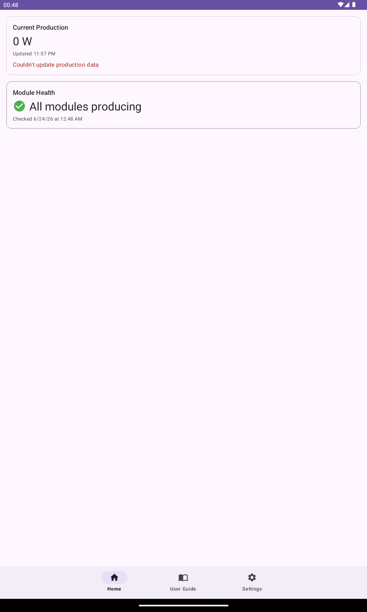
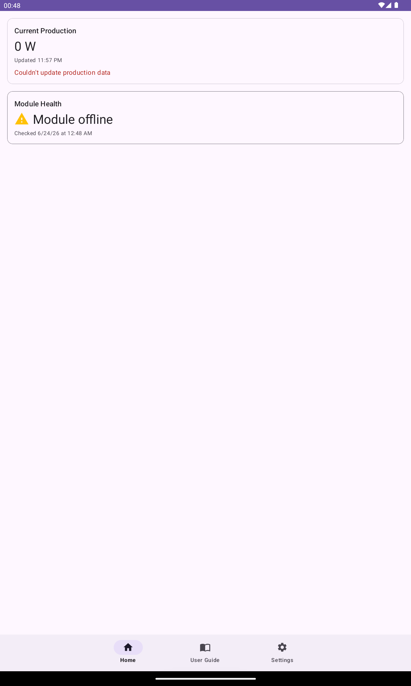
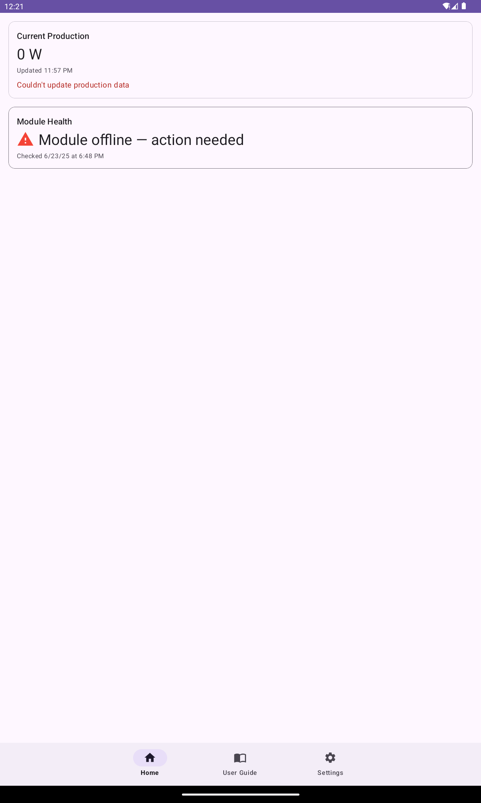
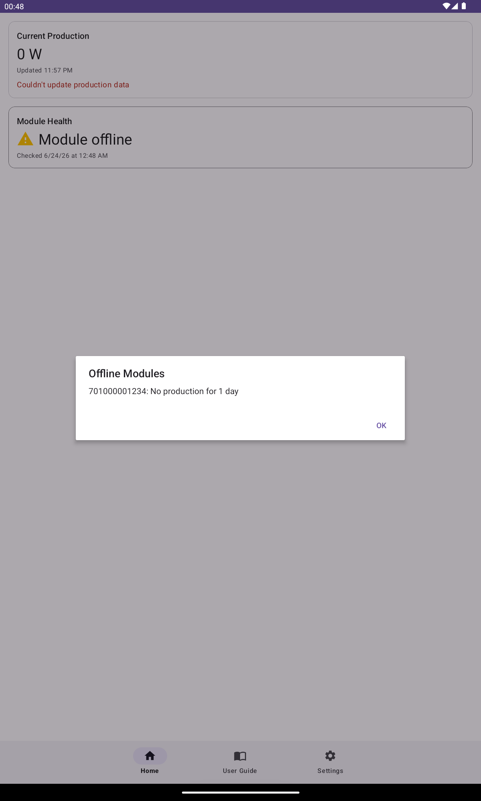

[User Guide](user-guide.md) › Home

# Home

The Home screen is a scrollable dashboard of tiles. Pull down anywhere on the screen to force a fresh fetch of all data. Each tile refreshes automatically when you open the app or return to this screen.

Each tile can be hidden if you don't need it — see the Tiles & Widgets section on the [Settings](settings.md) page.

## Today's Production tile

Shows today's hourly energy output as a line chart and a morning/afternoon table, plus summary cards.

**Chart:** Plots each recorded hour from 06:00 up to the current hour. Past hours are drawn with a solid line; the current (in-progress) hour is drawn with a dashed line to indicate it is still accumulating. Hours with no data are omitted. The Y-axis maximum equals your configured System Capacity (kW) when set; otherwise it scales to the data.

**Morning / Afternoon tables:** Two side-by-side columns list every hour from 00:00 to 23:00 with its kWh value. Missing hours show "—".

**Summary cards** (below the tables):

- **Today** — sum of all non-null hourly values, formatted to two decimal places
- **Best day this month** — date and kWh total of the highest-producing day in the current calendar month
- **Best day (N days)** — date and kWh total of the highest-producing day in the configured history window

A "Updated HH:mm" line appears below the chart after the first successful fetch. Data is cached and refreshed at most once per hour; pull to refresh forces an immediate update.

## Production History tile

Shows daily energy totals as a colour-coded bar chart over your history window.

**Chart:** One bar per calendar day. Bars are colour-coded by calendar month, with a legend below the chart identifying each month's colour. The X-axis labels every other day number. The Y-axis maximum follows the same System Capacity rule as the Today chart.

**Period totals** (below the legend):

- **This month** — total kWh for all days in the current calendar month
- **Last 30 days** — total kWh for the 30-day window ending today

Daily totals for past days are cached permanently and never re-fetched. Only today's bar is refreshed on each visit (at most once per hour). Pull to refresh forces today's bar to update immediately.

## Module Health tile

Shows whether your individual solar modules have been producing over the last three days. The tile follows the same layout as the Current Production tile: a title line, a content line showing a status icon alongside the status text, and a footer line showing when the last check ran.

| Status | Icon | Meaning |
|---|---|---|
| **All modules producing** (green) | ✓ checkmark | Every module reported energy on each of the past three days |
| **Module offline** (yellow) | ⚠ warning | One or more modules had zero production for 1–2 consecutive days |
| **Module offline — action needed** (red) | ⚠ warning | One or more modules had zero production for 3 consecutive days |
| **Checking…** (gray) | ✓ checkmark | The first background check has not run yet |

A "Checked [date] at [time]" line appears below the status once a check has completed.

If a check fails, the status icon changes to a **?** (gray) and a short error line appears beneath the checked timestamp:

- **Network issue — couldn't check** — the app could not reach the EMA service
- **Authentication failed — check your API credentials** — your credentials were rejected; check them in Settings
- **Couldn't check module status** — another error, such as an invalid ECU ID or a server problem

**Viewing details:** Tap the tile when it shows yellow or red to open an **Offline Modules** dialog listing each affected module and how many consecutive days it had no production. The tile is not tappable when green or unknown.

**How the check works:** A background job runs once per day at 8 pm in your array's timezone. It fetches three days of per-module energy, classifies each module, and caches past days permanently. The tile shows the result immediately when you open Home.

**Notifications:** When Module Health finds a yellow or red status, EMA Companion sends a push notification. On Android 13 and later, the app requests notification permission on first launch — granting it is recommended.
