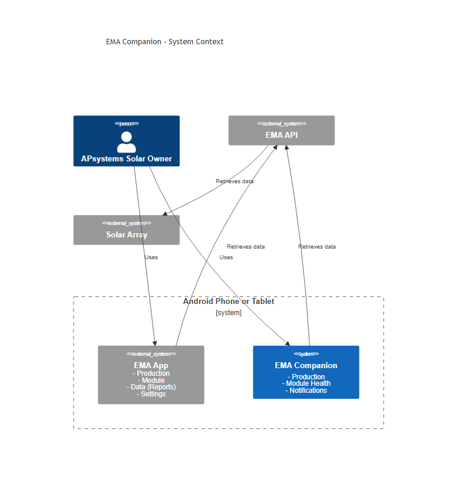

# EMA Companion User Guide

## Overview

EMA Companion is an Android app for APsystems solar array owners. It works alongside the existing EMA app — not replacing it — and adds detailed production statistics, module health monitoring, and push notifications.

## Getting Started

Install EMA Companion on your Android phone or tablet (Android 12 or later required). Open it from your home screen or app drawer.

**First launch:** The app opens directly to the **Settings** screen and the Home navigation item is disabled. You must enter your EMA API credentials and system capacity before the rest of the app becomes accessible.

Once all required fields are saved, the bottom navigation bar unlocks and you can freely switch between screens.

## Navigation

A bottom navigation bar runs across the bottom of every screen:

- **Home** — the main dashboard showing current solar production and module health
- **User Guide** — this guide, viewable inside the app
- **Settings** — app preferences and configuration
- **Support** — links to support the developer

When the app is not fully configured, only **Settings**, **User Guide**, and **Support** are reachable. Home re-enables automatically once configuration is complete.

## Sections

- [Home](home.md) — current production, today's hourly chart, production history, module health, and push notifications
- [Settings](settings.md) — credentials, array timezone, app preferences, and API configuration
- [Home-Screen Widgets](widgets.md) — three Android home-screen widgets for at-a-glance production data
- [Support](support.md) — Buy Me a Coffee and website links
